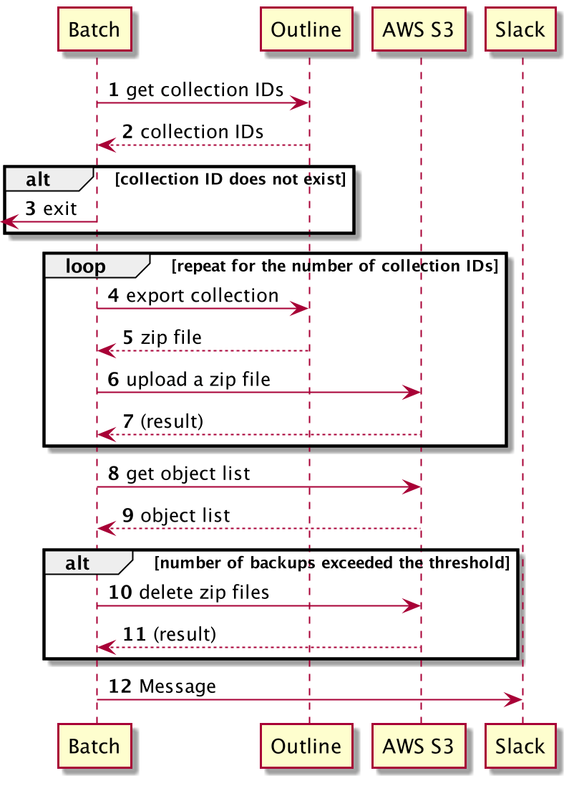

# outline-backuper

outline-backuper is batch that takes backups for each collection from [Outline (wiki)](https://www.getoutline.com/) and saves it in S3.

## Sequence

## Environment

| Environment            | Note                                                         |
| ---------------------- | ------------------------------------------------------------ |
| OUTLINE_BASE_URL       | base URL of the Outline API. e.g.) `http://localhost/api` |
| OUTLINE_TOKEN          | API token generated by Outline.                              |
| OUTLINE_COLLECTION_IDS | Comma-separated collection IDs. e.g.) `0578522C-820E-40CC-9CCC-2703F86E4A2E,BD2D2AFB-F884-44A7-A6BC-A4882EA49B66` |
| AWS_ACCESS_KEY_ID      | access key generated by AWS.                                 |
| AWS_SECRET_ACCESS_KEY  | secret access key generated by AWS.                          |
| AWS_REGION             | AWS region. e.g.) `ap-northeast-1`                      |
| AWS_S3_BUCKET          | Backup destination S3 bucket name.                           |
| SLACK_BOT_TOKEN        | Bot token generated by Slack.                                |
| SLACK_CHANNEL_ID       | Slack channel ID to notify results.                          |
